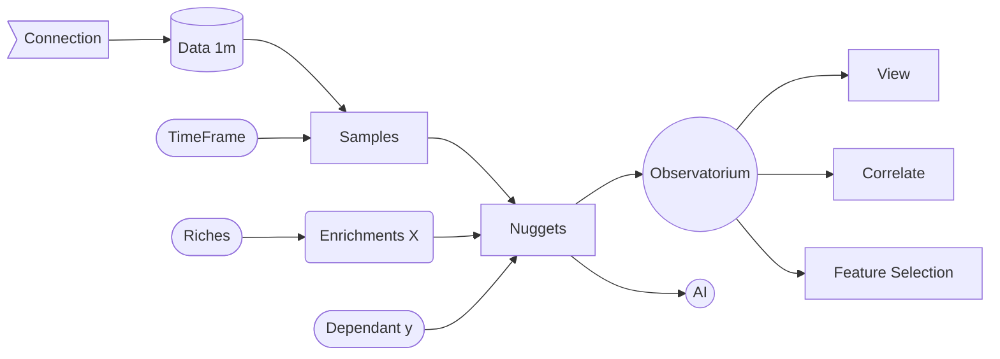

# AITB

AI Trader Bench Alpha. Currently just downloads the data and nuggets it to visualize it. Build path is now active.

## Requirements
```pip
pip install -r requirements.txt
```

## Run
```bash
python app.py
```
Then go to http://localhost:5000/register
Then sign in http://localhost:5000/login

## Diagrams

